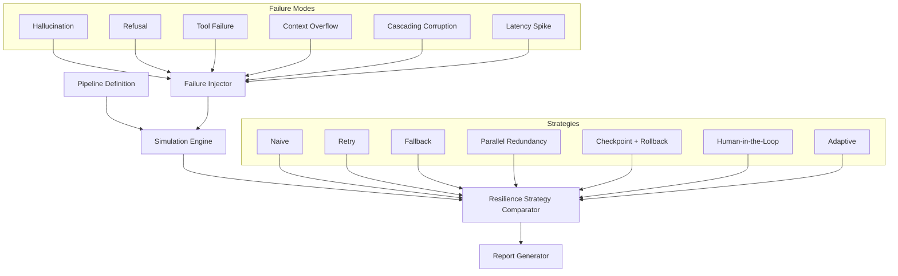

# floww

[](https://github.com/sushaan-k/floww/actions)
[](https://pypi.org/project/floww/)
[](https://pypi.org/project/floww/)
[](https://www.python.org/downloads/)
[](LICENSE)
[](https://github.com/astral-sh/ruff)

**Agent reliability simulator — chaos engineering for AI agent pipelines.**

`floww` is a Monte Carlo simulation framework that models multi-step agent systems, injects realistic failure modes (hallucination, tool failure, latency, context loss), and measures end-to-end reliability under different resilience strategies.

> **Why This Exists**  
> You deploy a 5-step agent workflow that works flawlessly in testing. In production it silently fails 40% of the time because steps 3 and 4 have correlated failures nobody modeled. Classical chaos engineering (Chaos Monkey, Gremlin) doesn't understand LLM-specific failure modes. `floww` does.

---

## The Problem

Accuracy compounds catastrophically in multi-step agent pipelines:

| Steps | Per-Step Accuracy | End-to-End Success |
|-------|------------------|--------------------|
| 5     | 95%              | 77%                |
| 10    | 95%              | 60%                |
| 10    | 85%              | 20%                |
| 20    | 90%              | 12%                |
| 50    | 95%              | 8%                 |

A 95%-accurate agent on a 50-step task succeeds **8% of the time**. Netflix built Chaos Monkey to test distributed systems resilience. `floww` is the equivalent for AI agents.

## Quick Start

```bash
pip install floww
```

Minimal simulation:

```python
from cascade import Pipeline, Step, Simulator, FailureConfig
from cascade import strategies

# Define your agent pipeline
pipeline = Pipeline(steps=[
    Step(name="research", model="sonnet", tools=["web_search", "read_file"]),
    Step(name="analyze", model="sonnet", tools=["python_exec"], depends_on=["research"]),
    Step(name="draft", model="sonnet", tools=["write_file"], depends_on=["analyze"]),
    Step(name="review", model="opus", tools=["read_file"], depends_on=["draft"]),
    Step(name="revise", model="sonnet", tools=["write_file"], depends_on=["review"]),
    Step(name="publish", model="haiku", tools=["api_call"], depends_on=["revise"]),
])

# Configure failure injection
failures = FailureConfig(
    hallucination_rate=0.05,
    refusal_rate=0.02,
    tool_failure_rate=0.03,
    context_overflow_at=100_000,
    cascade_propagation=0.8,
)

# Run 10,000 simulations
sim = Simulator(pipeline, failures, n_simulations=10_000, seed=42)
results = sim.run()

# Compare resilience strategies
from cascade import Comparator
comp = Comparator(pipeline, failures, n_simulations=10_000, seed=42)
comparison = comp.compare([
    strategies.naive(),
    strategies.retry(max_attempts=3),
    strategies.parallel(n=3, vote="majority"),
    strategies.checkpoint(interval=2),
    strategies.adaptive(escalation_threshold=2),
])

comparison.print_table()
comparison.recommend()
```

**Output:**

```
Strategy Comparison (10,000 simulations each):
+-----------------------+----------+-----------+----------+------------+
| Strategy              | Success  | Avg Cost  | Avg Time | Failures   |
+-----------------------+----------+-----------+----------+------------+
| Naive                 |  54.0%   |  $0.0318  |   6.1s   |      4,599 |
| Retry(3)              |  99.3%   |  $0.0451  |   8.5s   |         73 |
| Parallel(3)           |  84.8%   |  $0.1146  |   7.3s   |      1,525 |
| Checkpoint(2)         |  99.9%   |  $0.0453  |   8.6s   |          8 |
| Adaptive              |  99.3%   |  $0.0451  |   8.5s   |         73 |
+-----------------------+----------+-----------+----------+------------+

Recommendation: Retry(3) (99.3% success at 1.4x baseline cost)
```

## Architecture



## Failure Models

| Failure Mode | Description | Default Rate |
|---|---|---|
| **Hallucination** | Agent produces plausible but incorrect output (wrong tool args, fabricated data, incorrect reasoning, format errors) | 5% |
| **Refusal** | Safety filter blocks a legitimate action (false positive) | 2% |
| **Tool Failure** | External API returns an error, timeout, or rate limit | 3% |
| **Context Overflow** | Context window fills up, losing earlier information | At 128K tokens |
| **Cascading Corruption** | Hallucinated output propagates to downstream steps | 80% propagation |
| **Latency Spike** | Individual step takes 10x longer than expected | 1% |

## Resilience Strategies

```python
from cascade import strategies

strategies.naive()                    # No retry, fail fast
strategies.retry(max_attempts=3)      # Simple retry
strategies.fallback(models=["sonnet", "haiku"])  # Try models in order
strategies.parallel(n=3, vote="majority")  # Run N agents, majority vote
strategies.checkpoint(interval=5)     # Checkpoint every N steps, rollback on failure
strategies.human_in_loop(at_steps=[5, 10])  # Human verification at key steps
strategies.adaptive(                  # Escalate after repeated failures
    escalation_threshold=2,
    escalation_strategy="parallel",
)
```

## Strategy Comparison

| Strategy | Effect on Success | Cost | Latency Impact |
|---|---|---|---|
| No mitigation | Baseline | $1x | Baseline |
| Retry (n=3) | +8–15pp | $2.1x | +40% |
| Fallback model | +10–18pp | $1.3x | +10% |
| Checkpoint resume | +14–22pp | $1.1x | +5% |
| Parallel redundancy | +18–28pp | $3.0x | −20% |
| Human review | +25–40pp | $1.1x + human time | Minutes |
| Adaptive | +20–32pp | $1.8x | Varies |

*pp = percentage points of end-to-end success rate improvement. Numbers vary with pipeline length and failure profiles.*

## API Reference

### Core Classes

- **`Pipeline`** — DAG of Steps defining the agent workflow
- **`Step`** — Single agent action with model, tools, and dependencies
- **`FailureConfig`** — Failure injection probabilities and parameters
- **`Simulator`** — Monte Carlo simulation engine
- **`Comparator`** — Multi-strategy comparison orchestrator
- **`StrategyComparison`** — Results container with table, plot, and recommend methods

### Key Functions

- **`strategies.naive()`** / **`retry()`** / **`fallback()`** / **`parallel()`** / **`checkpoint()`** / **`human_in_loop()`** / **`adaptive()`** — Strategy factories
- **`build_report(result)`** — Build structured report from SimulationResult
- **`format_report(report)`** — Format report as human-readable text
- **`export_json(report, path)`** — Export report to JSON

### Statistical Utilities

- **`proportion_ci(successes, total)`** — Wilson score CI for success rates
- **`mean_ci(values)`** — t-distribution CI for means
- **`summarize(values)`** — Distribution summary (mean, median, percentiles)
- **`pareto_frontier(costs, rates)`** — Compute Pareto-optimal strategies

## CLI

```bash
# Run a single simulation
floww simulate pipeline.json --strategy retry --simulations 10000
floww simulate pipeline.json --strategy retry:5 --simulations 10000

# Compare strategies
floww compare pipeline.json --strategies naive,retry,parallel,checkpoint,adaptive
floww compare pipeline.json --strategies naive,retry:4,parallel:5:any,checkpoint:3

# Export results
floww compare pipeline.json -o results.json --pareto pareto.png --heatmap heatmap.png
```

CLI strategy specs support tunable resilience parameters:

| Spec | Meaning |
| --- | --- |
| `retry:5` | Retry each step up to five attempts |
| `fallback:opus+sonnet+haiku` | Try fallback models in order |
| `parallel:5:any` | Run five agents and pass if any succeeds |
| `checkpoint:3` | Checkpoint every three steps |
| `human:0+2:0.9` | Human review at zero-based steps 0 and 2 with 90% accuracy |
| `adaptive:1:fallback` | Escalate to fallback after one repeated failure |

## Examples

See the [`examples/`](examples/) directory:

- **`research_pipeline.py`** — 6-step research agent with full strategy comparison
- **`coding_pipeline.py`** — 10-step coding agent demonstrating the compounding problem
- **`customer_support.py`** — Diamond-shaped pipeline with parallel research paths

Run the offline walkthrough:

```bash
uv run python examples/demo.py
```

## Development

```bash
git clone https://github.com/sushaan-k/floww.git
cd floww
pip install -e ".[dev]"
pytest -v
ruff check src/ tests/
mypy src/cascade/
```

## Contributing

Contributions are welcome. Please:

1. Fork the repository
2. Create a feature branch (`git checkout -b feature/amazing-feature`)
3. Write tests for your changes
4. Ensure all tests pass (`pytest -v`)
5. Ensure code passes linting (`ruff check .`)
6. Submit a pull request

## License

MIT License. See [LICENSE](LICENSE) for details.
